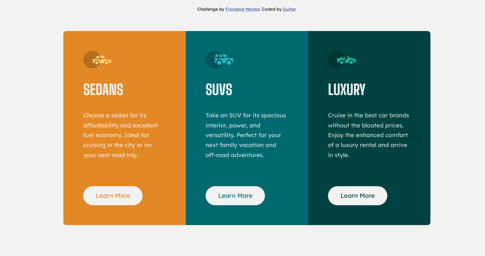

# Frontend Mentor - 3-column preview card component solution

This is a solution to the [3-column preview card component challenge on Frontend Mentor](https://www.frontendmentor.io/challenges/3column-preview-card-component-pH92eAR2-). Frontend Mentor challenges help you improve your coding skills by building realistic projects.

## Table of contents

- [Overview](#overview)
  - [The challenge](#the-challenge)
  - [Screenshot](#screenshot)
  - [Links](#links)
- [My process](#my-process)
  - [Built with](#built-with)
  - [What I learned](#what-i-learned)
  - [Continued development](#continued-development)
- [Author](#author)

## Overview

### The challenge

Users should be able to:

- View the optimal layout depending on their device's screen size
- See hover states for interactive elements

### Screenshot



### Links

- Solution URL: [View solution URL](https://www.frontendmentor.io/solutions/3-column-cardmobile-first-wM-KejKaID)
- Live Site URL: [View Live site URL](https://ttar007.github.io/3-column-cards/)

## My process

### Built with

- Semantic HTML5 markup
- CSS
- Flexbox
- CSS Grid
- Mobile-first workflow

### What I learned

I learned about grid-row and grid-column to span each card to change grid based on users' screen size.

```css
@media (min-width: 700px) {
  main {
    grid-template-columns: repeat(4, 1fr);

    border-radius: 0;
  }

  .sedans {
    grid-column: 1 / 3;
  }

  .suvs {
    grid-column: 3 / 5;
  }

  .luxury {
    grid-column: 2 / 4;
  }
}
```

### Continued development

I will continue to focus on writing a good html structure and use accurate sematic html.

## Author

- Website - [Not available yet]()
- Frontend Mentor - [@TTAR007](https://www.frontendmentor.io/profile/TTAR007)
- Twitter - [@T_TAR_007](https://x.com/T_TAR_007)
